# After Effects Theme

A [Windhawk](https://windhawk.net/) mod that recolors the whole Adobe After
Effects interface — panels, Timeline, viewers, window frame and menu bar — far
past what the Appearance brightness slider reaches.

It is the sister of
[Premiere Pro Theme](https://github.com/CakeDev4k/premiere-pro-theme), and
carries the same fifteen palettes and the same custom theme: After Effects and
Premiere are built on the same Adobe UI toolkit, `dvaui.dll`, so a palette
lands on both the same way. The custom theme has the same fields, less
Premiere's Monitor background.

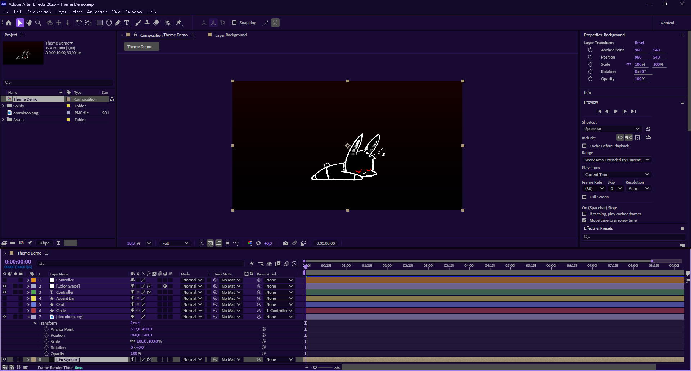

## Palettes

Each screenshot is After Effects 2026 restarted on that palette, so every
layer had painted from startup. Click one for full size.

Neutral:

| Onyx | Abyss |
|------|-------|
| 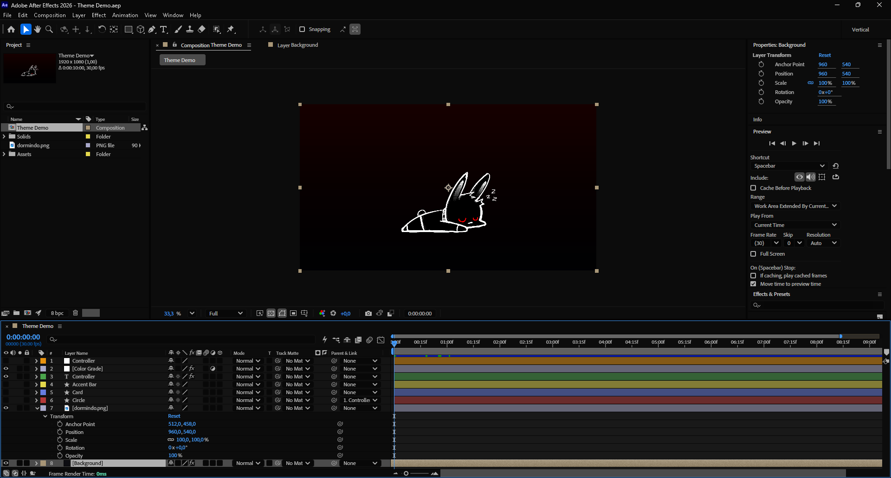 | 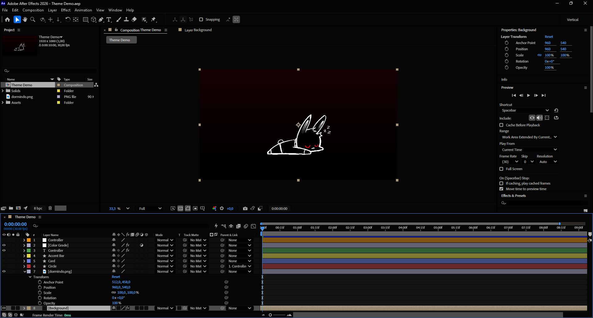 |
| **Graphite** | **Contrast** |
| 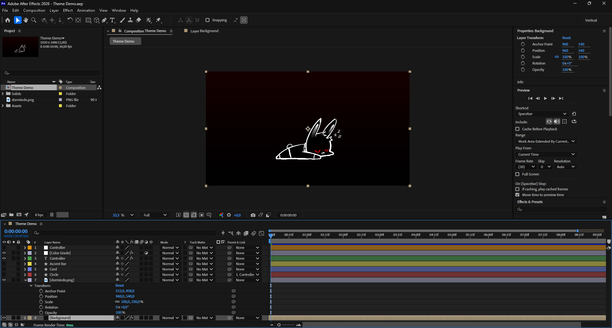 | 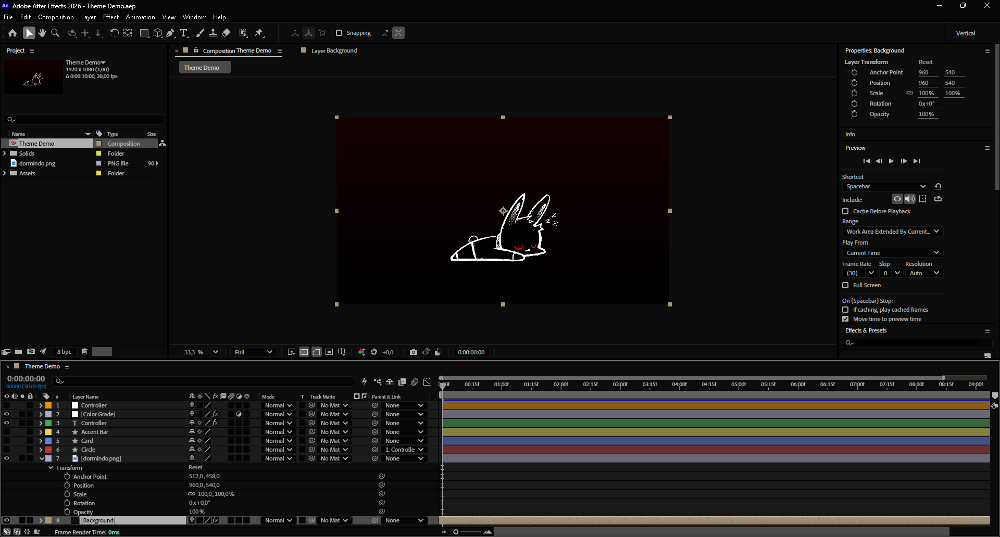 |

Tinted:

| After Effects | Comfy |
|---------------|-------|
| 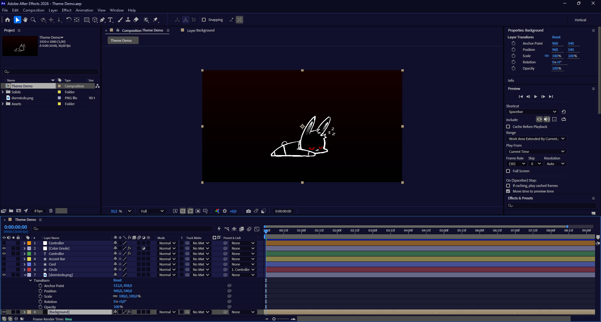 | 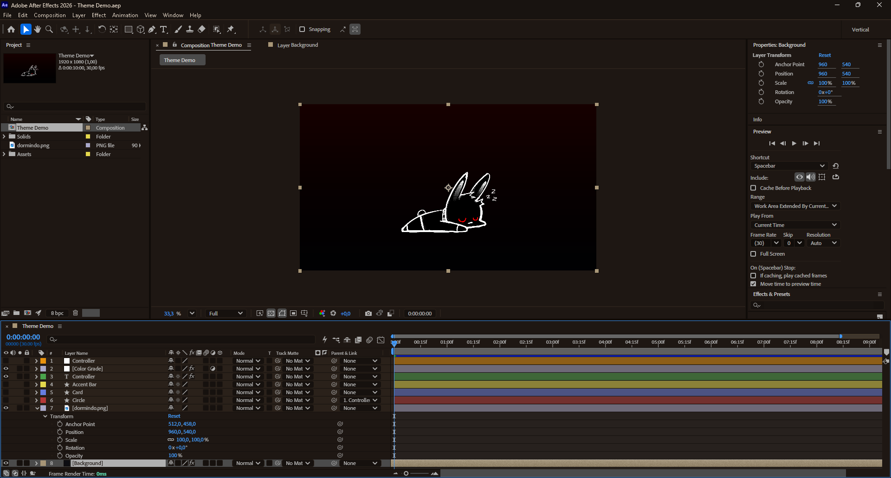 |
| **Neon** | **Glitch** |
| 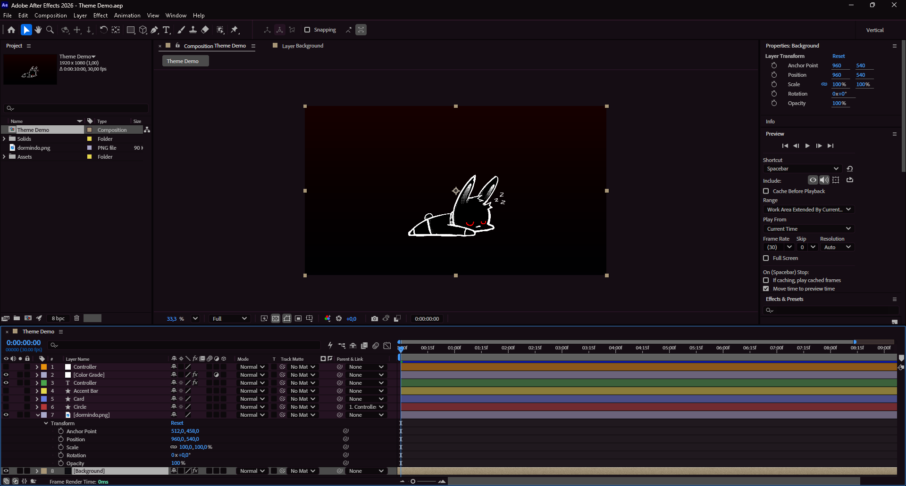 | 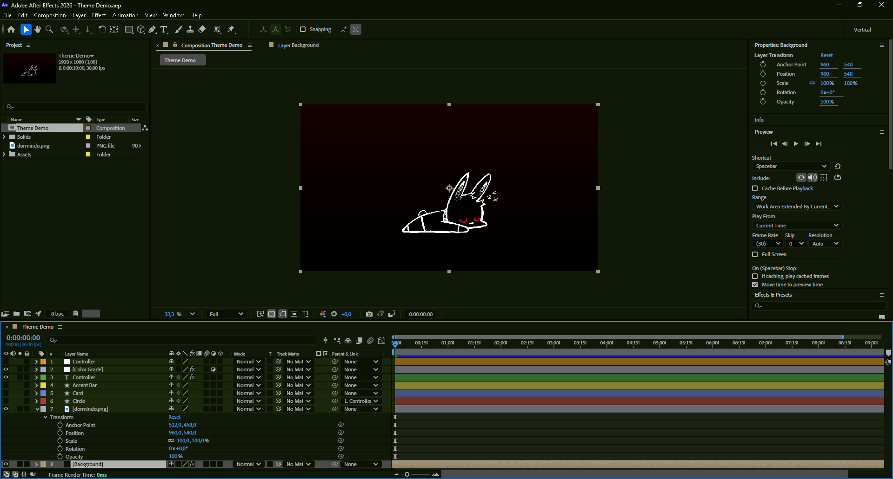 |

Vivid — the hue is in the ramp, so the panels themselves carry it:

| Violet | Blossom |
|--------|---------|
|  | 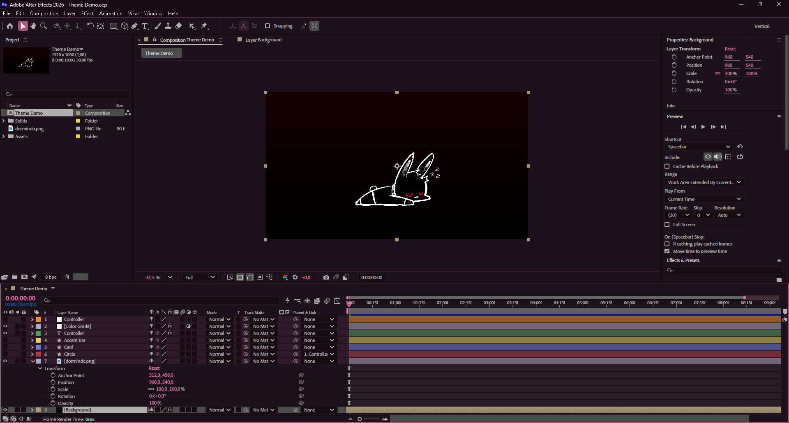 |
| **Ember** | **Crimson** |
| 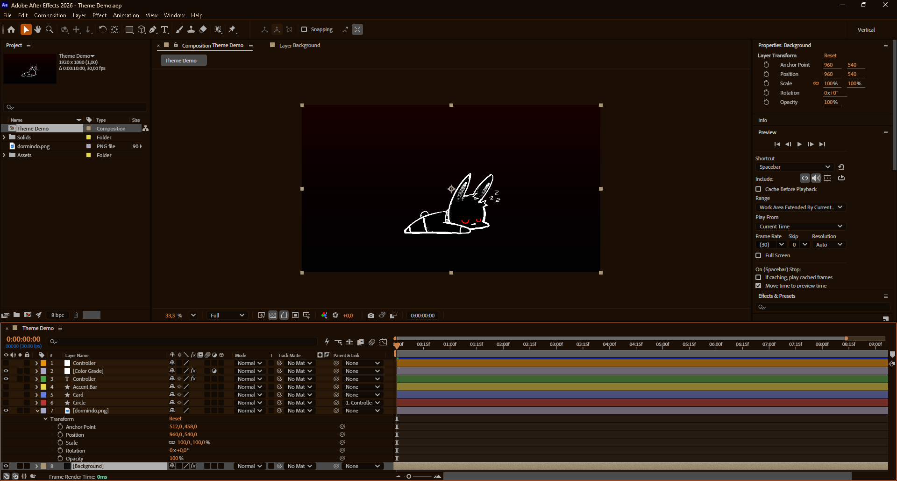 | 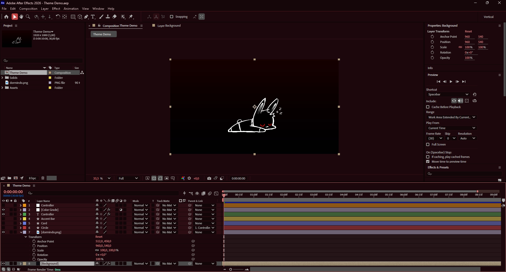 |
| **Miku** | |
| 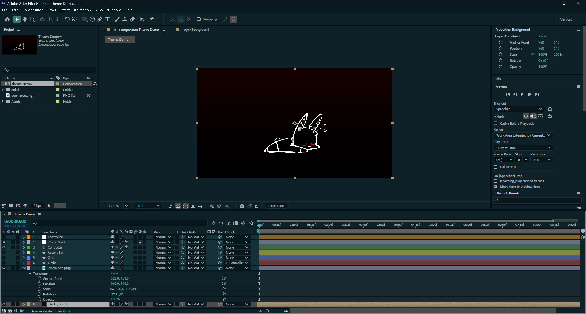 | |

Strong accent on near black — the panels stay neutral, and the color is only
the edge, the accent and the highlight:

| Amethyst | Threshold |
|----------|-----------|
| 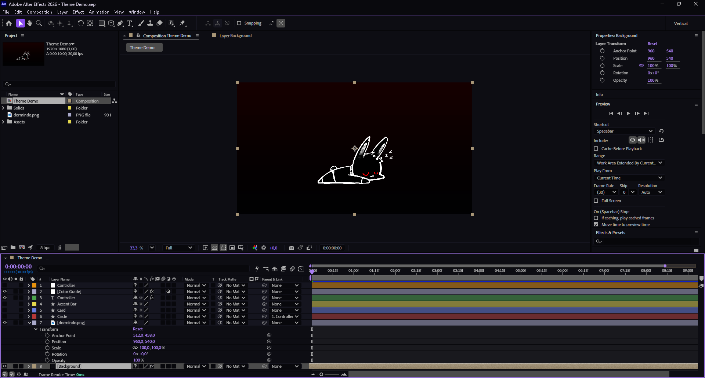 |  |

Their exact colors are in the mod's own readme at the top of
[`after-effects-theme.wh.cpp`](after-effects-theme.wh.cpp).

## Install

1. Install [Windhawk](https://windhawk.net/).
2. Find **After Effects Theme** in the mod browser and install it.
3. Restart After Effects. It only repaints everything on startup.

To build it yourself instead: create a new mod in Windhawk, paste
[`after-effects-theme.wh.cpp`](after-effects-theme.wh.cpp) over the template,
and compile.

## What it does

After Effects paints its interface through five different mechanisms, and the
mod covers all five:

- **`dvaui.dll`** — Adobe's UI toolkit, which hands out the Spectrum gray ramp.
  Twenty-six color functions are intercepted here: the classic theme, the
  Spectrum ramp, and the DNA/skins families. `AfterFXLib.dll`, which draws the
  panels, the Timeline and the viewers, imports nearly two thousand symbols
  from it.
- **The Direct2D brush factory** — where most solid fills pass through,
  whoever picked the color.
- **GDI** — brushes, pens and text backgrounds created by Adobe's own modules.
- **Win32** — the title bar, the `File / Edit / Composition` menu bar and the
  dropdown menus, none of which any theme reaches.
- **UXP** — the Home screen, drawn from stylesheets, scripts and design
  tokens of its own, with a webview for the bar across its top; the mod
  recolors each as After Effects reads it. Off by default: it reads them once,
  so that layer only follows a change across a restart.

Colors that are content are left alone: layer labels, keyframes, the color
picker, color chips, the solid-color button and the gradient editor's ramp.
The full explanation — what each layer changes, what it leaves alone, and the
palettes' colors — is in the mod's own readme at the top of
[`after-effects-theme.wh.cpp`](after-effects-theme.wh.cpp), which is also what
Windhawk shows on the mod's page.

## What stayed in Premiere Pro Theme

Three layers of the Premiere mod have nothing to act on here, and were left
out rather than carried along:

- **`UIFramework.dll`** is Premiere's own drawing layer; After Effects has no
  such module.
- **The toolkit linked into the executable** is a Premiere 2026.3 build
  matter. After Effects 2026 still ships `dvaui.dll`.
- **The monitor band**, the D3D12 layer that recolors the surround of the
  Source and Program monitors, is recognized by the shape of Premiere's own
  draws. After Effects' viewers are not those monitors, and that layer is not
  one to carry over unmeasured.

## Compatibility

Every color function is looked up by name at startup; the ones the running
build exports get hooked and the rest are logged and skipped. A version that
moved or dropped a function loses that surface, not the mod.

| After Effects | Color functions found | Drawing primitives |
|---------------|-----------------------|--------------------|
| 2026          | 26 of 26              | 5 of 5             |
| 2023          | 7 of 26               | 4 of 5             |

The window frame, menu bar and native dialogs are Windows, not After Effects,
and work on any version. Native dark mode needs Windows 10 build 17763 or
newer.

## Tests

    pwsh tests/run.ps1

builds the mod with Windhawk's own compiler and runs the logic tests in
[`tests/harness.cpp`](tests/harness.cpp); [`tests/README.md`](tests/README.md)
says what they cover.

## Questions, bugs and palettes

Bug reports and palette suggestions are welcome on
[Discord](https://discord.gg/m5kVMR8Vuu), where an After Effects build and a
screenshot are usually all it takes to work one out.
